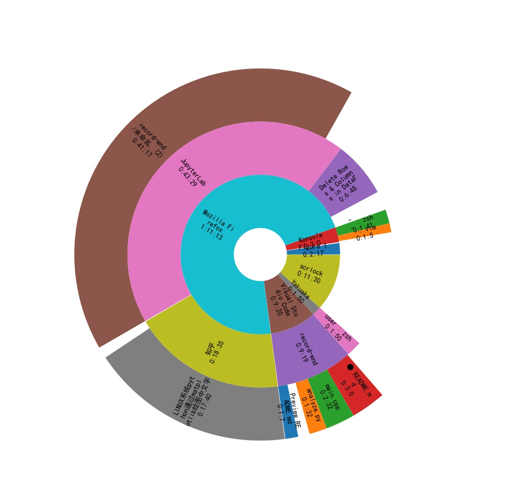

# wndrecd

**Only available with Arch Linux**

Recording the windows title you activate each time in KDE, to help you analyzing your time comsumption.

## install

Download `pkgbuild/PKGBUILD` file, then `makepkg -si`.

## Usage

run `wndrecd`, recording the windows title you activate each time.

```bash
$ wndrecd
start receiver
register listener
register kwin script
script index: 1
run script
2022-02-05 12:21:11.784, activate, user : zsh — Yakuake
2022-02-05 12:21:21.189, activate, main.cpp - record-wnd - Visual Studio Code
2022-02-05 12:21:22.266, activate, user : zsh — Yakuake
2022-02-05 12:21:27.160, activate, main.cpp - record-wnd - Visual Studio Code
2022-02-05 12:21:28.769, scrlock, scrlock
2022-02-05 12:21:31.586, activate, main.cpp - record-wnd - Visual Studio Code
2022-02-05 12:21:31.740, scrunlock, scrunlock
2022-02-05 12:21:32.952, activate, user : zsh — Yakuake
2022-02-05 12:21:40.814, activate, main.cpp - record-wnd - Visual Studio Code
2022-02-05 12:21:46.187, activate, user : zsh — Yakuake
2022-02-05 12:21:49.156, activate, main.cpp - record-wnd - Visual Studio Code
2022-02-05 12:24:12.224, activate, user : zsh — Yakuake
```

you can also start the service:
```bash
$ systemctl --user enable wndrecd@keke.service # replace `keke` to your user name
$ cat ~/.wndrecd.txt # the record is saved into wndrecd.txt
$ python analyze.py # you may need to `pip install pandas and matplotlib`
```

Also, a command helper `wndrec` is provided, you can copy it to your `/usr/local/bin`.

```bash
$ wndrec # show the picture
$ wndrec today # show today
$ wndrec 2022-02-04 # show 2022-02-04
$ wndrec clean # clean the log file
$ wndrec enable # alias to systemctl --user enable ...
$ wndrec start 
$ wndrec disable
```

